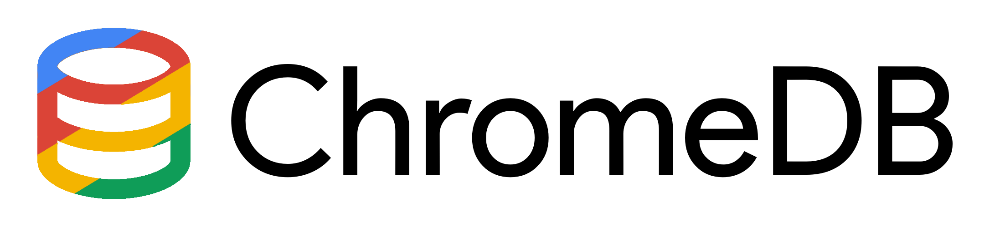

# Background

ChromeDB has two main motivations. Firstly it is meant as a powerful NoSQL wrapper for Chrome's sync and local storage APIs. Secondly, it is meant to integrate with GCP databases as a caching mechanism.

# Usage

```javascript
import ChromeDB from "./chromedb/js/ts/chromedb"

const main = async () => {
    let client: ChromeDB = await ChromeDB.init("MyDB");
    await client.makeCollection("MyCollection");
    
    await client.collection("MyCollection").add({"id": 0, "content": "hello"});
    
    var obj = await client.collection("MyCollection").get().where("id").is(0);
    console.log(obj);
}

main();
```

# Building

Use Webpack with a 'web' target to build your app. See the repository webpack.config.js for an example Webpack config. Your npm build script should include

```bash
npx webpack && cp ./chromedb/src/ts/query.wasm dist && cp manifest.json ./dist
```

In other words, Webpack your javascript, copy the query.wasm to the dist folder (or wherever your Webpack output is), and copy the manifest.json to the same folder

# Using GCP Datastore

Call the following function in your ChromeDB client before retrieving a collection:

```javascript
client.useDatastore(projectID);
```

# Why GCP?

GCP was the most viable cloud integration option because of its well-documented, fully supported HTTP REST API that is usable without any additional legwork.

# Future plans

* Implement caching mechanism
* Integrate Bigtable's HTTP API